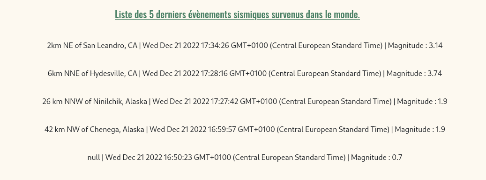
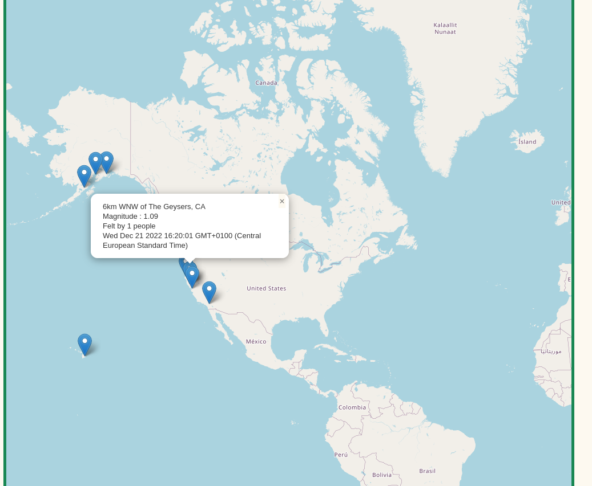

# Earthquake mapping

This project teached us how to call and use data from an api. 

We used the US earthquake api : <link>https://earthquake.usgs.gov</link> 

For printing earthquakes on map we used leaflet, a javaScript library interactive maps.

Just run the index.html file in you're favorite browser and it work!

